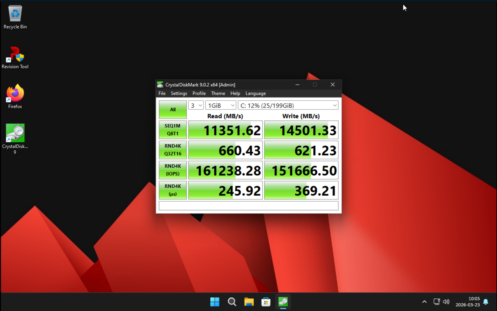
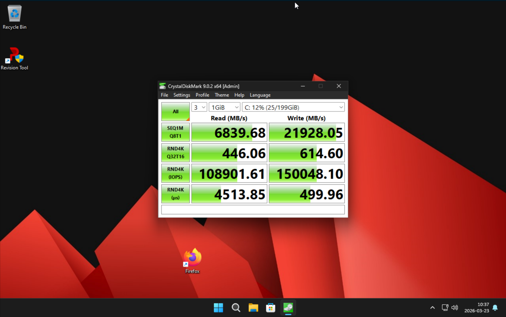
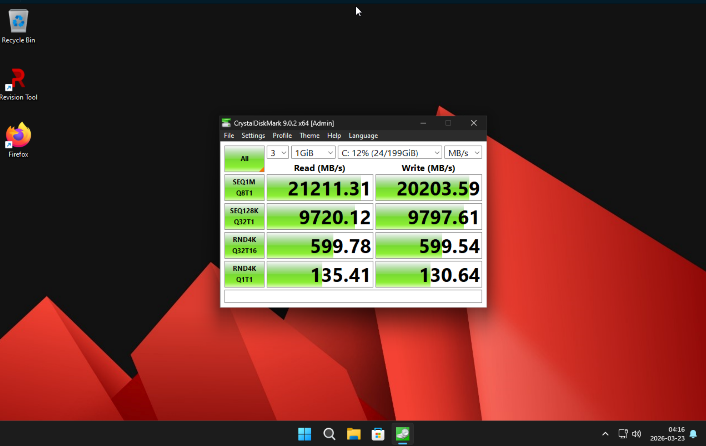
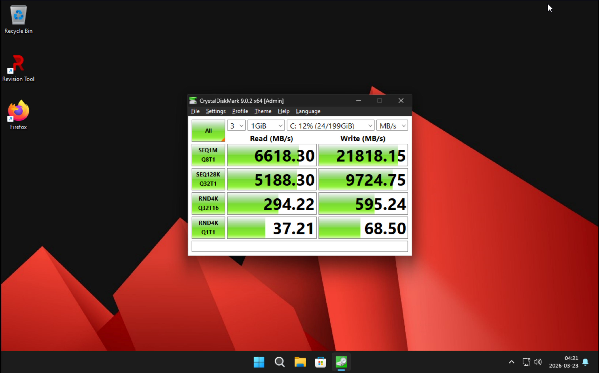

# Windows11 VM on ZFS, Benchmarks

## Benchmarks
- These VM runs on two WD nvme gen3 i ZFS stripe, with a dedicated zvol for a "real" nvme for the windows to run on
- These benchmarks is made with DDR5 6000mhz 64gb RAM

---

1. blocksize=16k and primarycache=metadata

2. blocksize=16k and primarycache=all

---

3. blocksize=64k and primarycache=metadata

4. blocksize=64k and primarycache=all

---

5. blocksize=128k and primarycache=metadata

6. blocksize=128k and primarycache=all

---
