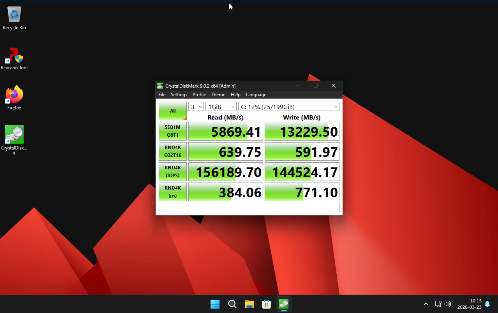

# Windows11 VM on ZFS, Benchmarks

## Benchmarks
These VM runs on two WD nvme gen3 i ZFS stripe, with a dedicated zvol for a "real" nvme for the windows to run on

1. blocksize=16k and primarycache=metadata

